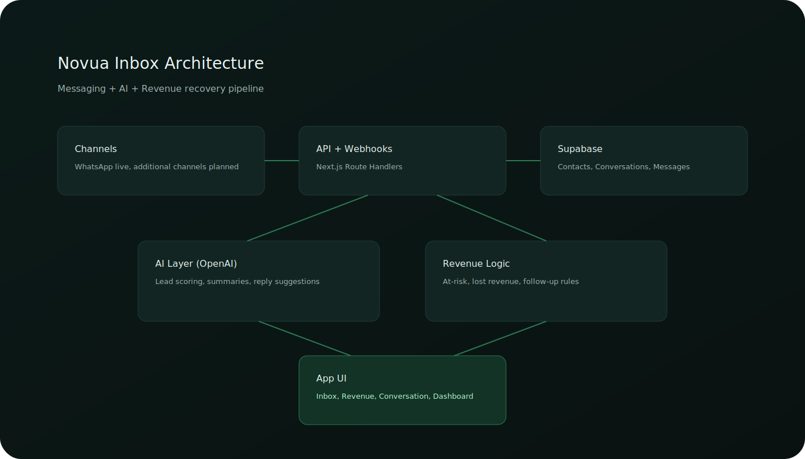

# Novua Inbox (AI Ops Inbox)

## Live Links

- Live Demo: https://ai-ops-inbox-one.vercel.app
- GitHub: https://github.com/iveteamorim/ai-ops-inbox
- Architecture: https://github.com/iveteamorim/ai-ops-inbox/blob/main/docs/architecture.svg


## Product Walkthrough

1. Open Inbox -> identify high-value or at-risk leads
2. Open a conversation -> review suggested actions and reply options
3. Navigate to Revenue -> review potential vs recovered value
4. Review architecture and screenshots in this repository for implementation context

## Business Impact

Designed to:

- Reduce response time by ~60–80%
- Recover revenue from unanswered leads
- Automate follow-ups and lead prioritization

Example:

A business receiving 50+ leads/day can lose €1,000+ per week due to slow response and missed follow-ups.

This system identifies high-value conversations, prioritizes them, and enables immediate action to recover that revenue.

AI-powered conversational revenue operations platform to centralize lead conversations, prioritize at-risk opportunities, and recover lost revenue.

## Architecture

- Next.js (App Router + API routes)
- Supabase (PostgreSQL, Auth, Row-Level Security)
- OpenAI (classification, scoring, response generation)

Core flows:

- Message ingestion → classification → lead scoring
- Priority queue generation based on business value
- Inactivity-based follow-up triggers
- Revenue estimation per conversation

   ## AI Layer

- Lead scoring (high / medium / low intent)
- Context-aware reply suggestions
- Revenue-at-risk estimation per conversation
- Follow-up trigger detection based on inactivity

Goal:

Turn raw conversations into prioritized revenue actions.

## Technical Highlights

- Multi-tenant access boundaries and company-scoped message flows.
- Signed webhook validation for WhatsApp ingestion.
- Hardened auth/session flows and production-ready middleware guards.
- Type-safe Next.js + Supabase implementation with linted CI-friendly structure.

## What this project demonstrates

- Production-grade AI integration inside a SaaS-style UX.
- Multi-tenant-oriented architecture for lead and conversation operations.
- Unified inbox flows across channels (foundation for WhatsApp/email/forms).
- Revenue recovery logic for unanswered and at-risk conversations.

## Real-world use case

Businesses lose revenue because leads are not answered in time across multiple channels.

Novua Inbox centralizes communication and applies AI to:

- Detect high-value leads.
- Suggest response actions.
- Trigger follow-up actions.
- Quantify lost or at-risk revenue.

## Core stack

- Frontend: Next.js (App Router)
- Backend: Next.js Route Handlers / API routes
- Database: Supabase (Postgres)
- AI: OpenAI API
- Integrations: WhatsApp Cloud API (scaffolded), email/form flows

## Project structure

- `src/app`: pages, routes, and API handlers
- `src/components`: UI and i18n components
- `src/lib`: auth, i18n, Supabase, messaging, utilities
- `public`: static assets and logo files
- `db`: schema and SQL assets
- `docs-messaging.md`: webhook/message flow notes

## Local setup

1. Install dependencies:

```bash
npm install
```

2. Create environment file:

```bash
cp .env.example .env.local
```

3. Run development server:

```bash
npm run dev
```

4. Open:

- `http://localhost:3000`

## Environment variables

Required for full auth/data behavior:

- `NEXT_PUBLIC_SUPABASE_URL`
- `NEXT_PUBLIC_SUPABASE_ANON_KEY`

Optional for webhook/admin flows:

- `SUPABASE_SERVICE_ROLE_KEY`
- `WHATSAPP_VERIFY_TOKEN`
- `WHATSAPP_APP_SECRET`
- `OPENAI_API_KEY`

If Supabase env vars are missing, protected routes stay locked and auth actions return configuration errors.

## Scripts

- `npm run dev` - start local development server
- `npm run build` - production build
- `npm run start` - run production server
- `npm run lint` - lint checks

## Current status

- Landing + product narrative + pricing UX implemented
- Inbox, conversation, dashboard, revenue, settings views implemented
- i18n support (ES/PT/EN)
- Currency detection with regional behavior (EUR/BRL) and manual override
- WhatsApp webhook/message persistence scaffolding included

## Screenshots

Inbox Demo


## Architecture



## Next steps

- Connect real Supabase project for production auth + persistence
- Connect Stripe billing and trial lifecycle
- Connect production WhatsApp Cloud API credentials
