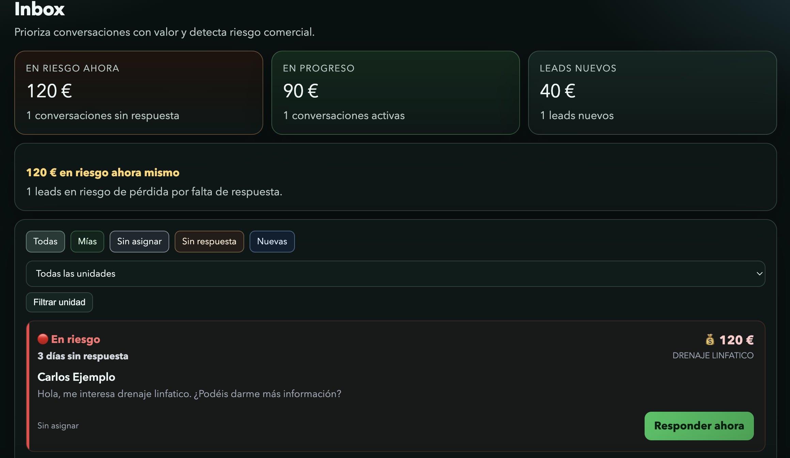

# Novua Inbox

Conversation operations workspace for teams that lose money when replies arrive too late.

Most teams don't know they are losing money in their inbox.

Novua makes that visible - and actionable.

---

## 💰 What is at risk right now?

Most teams don't lose inbound revenue because leads disappear.

They lose it because nobody acts in time.

- replies arrive too late
- high-value conversations are hidden in the noise
- ownership is unclear
- follow-ups never happen

The result is simple:

-> **money is lost silently inside the inbox**

---

## 🧠 What Novua does differently

Novua Inbox is not a CRM.

It is an operating layer that answers one question:

> **What conversation needs attention now, who owns it, and how much money is at risk if nobody acts?**

---

## ⚡ What you see immediately

- 💰 how much money is at risk right now
- 🔴 which conversations are critical
- 👤 who is responsible for each one
- 👉 what action should happen next

---

## 🚀 Live

Demo: https://ai-ops-inbox-one.vercel.app  
Repo: https://github.com/iveteamorim/ai-ops-inbox

## Screenshot



## Example

A clinic receives multiple WhatsApp inquiries per day.

Before:

- all conversations look the same
- replies depend on whoever is available
- valuable leads are missed

With Novua:

- high-value conversations are surfaced as `En riesgo`
- ownership is assigned automatically on first reply
- the team sees exactly what to answer next

-> response improves before revenue is lost

## Product model

### Inbox

The inbox is the main operating surface.

It renders conversations as decision cards instead of administrative rows, with emphasis on:

- `En riesgo`
- `Nuevo`
- `En conversación`
- `Ganado`
- `Perdido`

Each card highlights:

- current state
- response delay
- estimated value
- assignment
- next action

### Conversation ownership

Conversations are not meant to be manually distributed one by one.

The current rule is:

- the first agent who sends a real reply claims the conversation
- ownership remains on that conversation after the claim
- owner/admin can bulk reassign open conversations from one agent to another

To reduce duplicate replies:

- the UI refreshes periodically
- the backend blocks a second agent from replying if another agent already claimed the conversation

### Dashboard

The dashboard is not a generic reporting page.

It answers:

- what money is at risk now
- what is active now
- what should be handled next

### Revenue

The revenue view is built around:

- money at risk now
- open pipeline value
- recently recovered value
- immediate actions required

For agents, it is tactical.  
For owner/admin, it is broader across the workspace.

### Settings

Settings define how the workspace works.

It is organized around:

- channel status
- how Novua prioritizes work
- who answers customers
- business setup and lead values

This is where the workspace defines the lead types and estimated values used across inbox, revenue, and conversation views.

## Roles

### Owner

Can:

- manage the workspace
- invite and remove users
- bulk reassign open conversations
- edit business setup
- operate conversations

### Admin

Can:

- manage team and business setup
- operate conversations
- bulk reassign open conversations

### Agent

Can:

- work the inbox
- reply to conversations
- see system state
- report issues

Agent settings are intentionally reduced compared to owner/admin.

## What this enables

- teams respond before losing revenue
- ownership is clear across agents
- high-value conversations are never ignored
- follow-ups become systematic instead of manual

## What is still early

- full production hardening
- webhook retry and idempotency maturity
- deeper observability
- business setup UX still lags behind inbox
- some remaining edge-case copy and i18n cleanup

## Current stack

- `Next.js` App Router
- `React 19`
- `Supabase` for auth and data
- `Vercel` for deployment
- optional `OpenAI` integration for reply suggestions

## Local setup

### Requirements

- Node.js `>= 20`
- Supabase project with auth and database configured

### Install

```bash
npm install
```

### Run locally

```bash
npm run dev
```

App runs at:

```text
http://localhost:3000
```

### Lint

```bash
npm run lint
```

## Environment variables

### Required

- `NEXT_PUBLIC_SUPABASE_URL`
- `NEXT_PUBLIC_SUPABASE_ANON_KEY`

### Required for admin/server actions

- `SUPABASE_SERVICE_ROLE_KEY`

### Optional internal workspace controls

- `NOVUA_INTERNAL_EMAILS`
- `NOVUA_INTERNAL_DOMAINS`

### Optional WhatsApp / Instagram webhook setup

- `WHATSAPP_VERIFY_TOKEN`
- `WHATSAPP_APP_SECRET`
- `INSTAGRAM_VERIFY_TOKEN`
- `INSTAGRAM_APP_SECRET`

### Optional AI reply suggestions

- `OPENAI_API_KEY`

If `OPENAI_API_KEY` is missing, the app falls back to deterministic suggestion behavior in the UI and the API route returns the expected not-configured path.

## Project structure

- `src/app` - routes, pages, API endpoints
- `src/components` - UI and workflow components
- `src/lib` - app data, auth, i18n, internal access, scoring logic
- `public` - static assets
- `docs` - supporting documentation

## Operational behavior worth knowing

### Assignment visibility

A conversation is only treated as truly assigned in the UI once there is a human reply signal.

This prevents untouched conversations from looking owned too early.

### Multi-agent safety

The app uses two layers:

- periodic refresh in inbox and conversation views
- backend claim check before sending a reply

That means visual updates are near-real-time, while the actual protection is enforced server-side.

### Demo seeding

The repo includes demo-oriented flows for business setup and reseeding.
These are useful for walkthroughs, but should be treated as demo tooling, not final production onboarding architecture.

## What this repo is best for right now

This repo is best understood as:

- a serious product demo
- a pilot-ready inbox workflow
- a foundation for paid onboarding and pilot projects

It is not yet a fully hardened production platform.

## Bottom line

If you evaluate Novua Inbox, the key question is not:

- "does it have every CRM feature?"

The key question is:

- "does it help a team decide what to answer now, before money is lost?"
